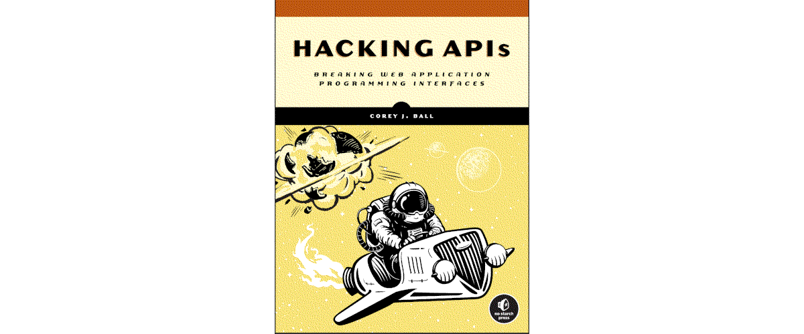

API mayhem
=====================================================

An API is a technology that enables communication between different applications. By relying on APIs, developers
can design modular applications that leverage the expertise of other applications. They no longer need to create
their own custom software to implement maps, payment processors, machine-learning algorithms, or authentication
processes. As a result, popular! Many modern web applications have been quick to adopt APIs.

- APIs have exploded applications’ attack surfaces.
- They are often poorly defended providing a direct route to their data.
- Many APIs lack the security controls that other attack vectors have in place.

API Penetration Testing is a type of security testing performed on application programming interfaces (APIs) to assess
the strength of the security controls in place.

----

.. toctree::
   :maxdepth: 1
   :includehidden:
   :caption: Preparation

   Build a local testlab <https://red.tymyrddin.dev/projects/testlab/en/latest/docs/api/README.html>
   Reconnaissance <https://red.tymyrddin.dev/projects/recon/en/latest/docs/api/README.html>
   Enumeration <https://red.tymyrddin.dev/projects/enum/en/latest/docs/app/api.html>
   docs/challenges.md

.. toctree::
   :glob:
   :maxdepth: 1
   :includehidden:
   :caption: Analysing endpoints

   docs/endpoints/README.md
   docs/endpoints/requests.md
   docs/endpoints/fuzzing.md

.. toctree::
   :glob:
   :maxdepth: 1
   :includehidden:
   :caption: Exploitation

   docs/exploit/README.md
   docs/exploit/authentication.md
   docs/exploit/authorisation.md
   docs/exploit/mass-assignment.md
   docs/exploit/traditional.md

.. toctree::
   :glob:
   :maxdepth: 1
   :includehidden:
   :caption: Evasion techniques

   docs/evasion/README.md
   docs/evasion/*

.. toctree::
   :glob:
   :maxdepth: 1
   :includehidden:
   :caption: GraphQL

   docs/graphql/README.md
   docs/graphql/*

----

